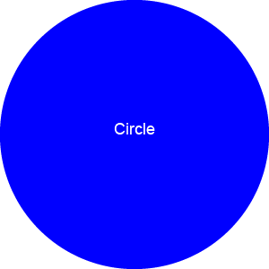

# Module 10 - Object-oriented-Programming-Challenge-SVG-Logo-Maker Third-Party APIs Challenge: Work Day Scheduler

## Description

This project is a Node.js command-line application that allows users to generate a logo and save it as an SVG file. The application will prompt the user to select a color, shape, and provide text for the logo. The SVG logo created based on user inputs is then saved to an SVG file.

## Table of Contents

- [How to Complete the Challenge](#how-to-complete-the-challenge)
- [User Story](#User-story)
- [Acceptance Criteria](#acceptance-criteria)
- [Mock Up](#mock-up)
- [Credits](#credits)
- [License](#license)

## How to Complete the Challenge

- Clone the starter codeLinks to an external site.
- Starter code is in a folder called Develop (will be in a branch called starter code).
- Modify the code to meet the Acceptance Criteria.

## User Story

AS a freelance web developer
I WANT to generate a simple logo for my projects
SO THAT I don't have to pay a graphic designer

## Acceptance Criteria

- GIVEN a command-line application that accepts user input
- WHEN I am prompted for text
- THEN I can enter up to three characters
- WHEN I am prompted for the text color
- THEN I can enter a color keyword (OR a hexadecimal number)
- WHEN I am prompted for a shape
- THEN I am presented with a list of shapes to choose from: circle, triangle, and square
- WHEN I am prompted for the shape's color
- THEN I can enter a color keyword (OR a hexadecimal number)
- WHEN I have entered input for all the prompts
- THEN an SVG file is created named `logo.svg`
- AND the output text "Generated logo.svg" is printed in the command line
- WHEN I open the `logo.svg` file in a browser
- THEN I am shown a 300x200 pixel image that matches the criteria I entered

## Mock Up

## Credits

- https://coding-boot-camp.github.io/full-stack/github/professional-readme-guide
- https://jestjs.io/
- https://developer.mozilla.org/en-US/play
- https://www.w3schools.com/
- https://www.npmjs.com/package/babel-jest
- https://jestjs.io/docs/mock-functions
- https://courses.bootcampspot.com/ (Challenge description)
- https://www.youtube.com/@code
- https://www.youtube.com/@Fireship

## License

MIT License

Copyright (c) 2023 xkolsha

Permission is hereby granted, free of charge, to any person obtaining a copy
of this software and associated documentation files (the "Software"), to deal
in the Software without restriction, including without limitation the rights
to use, copy, modify, merge, publish, distribute, sublicense, and/or sell
copies of the Software, and to permit persons to whom the Software is
furnished to do so, subject to the following conditions:

The above copyright notice and this permission notice shall be included in all
copies or substantial portions of the Software.

THE SOFTWARE IS PROVIDED "AS IS", WITHOUT WARRANTY OF ANY KIND, EXPRESS OR
IMPLIED, INCLUDING BUT NOT LIMITED TO THE WARRANTIES OF MERCHANTABILITY,
FITNESS FOR A PARTICULAR PURPOSE AND NONINFRINGEMENT. IN NO EVENT SHALL THE
AUTHORS OR COPYRIGHT HOLDERS BE LIABLE FOR ANY CLAIM, DAMAGES OR OTHER
LIABILITY, WHETHER IN AN ACTION OF CONTRACT, TORT OR OTHERWISE, ARISING FROM,
OUT OF OR IN CONNECTION WITH THE SOFTWARE OR THE USE OR OTHER DEALINGS IN THE
SOFTWARE.

## Badges

